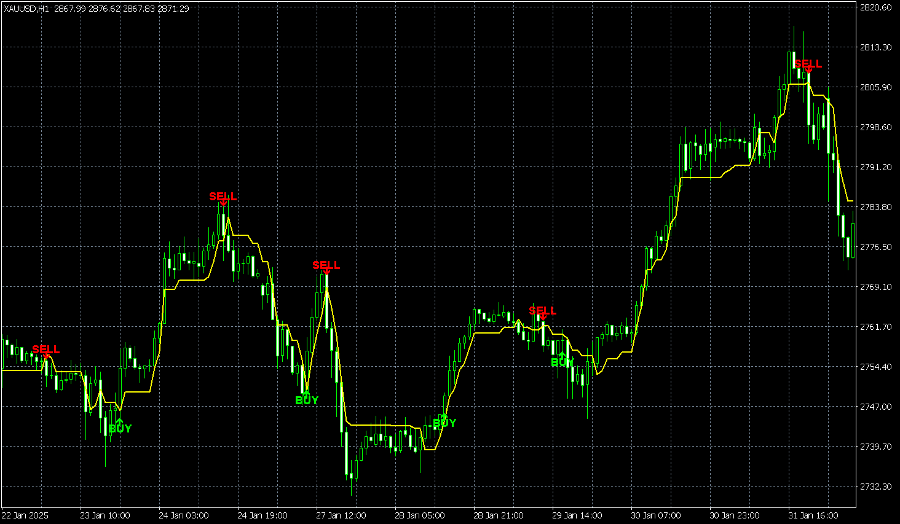

# UT Bot Alert Indicator v5.0 (Pro)

**Strong BUY & SELL Signals • Non-Repainting • Multi-Confirmation**

---

## Screenshots

### Chart Overview
<!-- Add your main chart screenshot here: images/chart-overview.png -->

> **Note:** Place your screenshots in the `images` folder with the filenames above, or update the paths to match your image names.

---

## Overview

UT Bot Alert Indicator is a powerful MetaTrader 4 (MT4) custom indicator that generates **strong, high-probability BUY and SELL signals** based on ATR (Average True Range) trailing stop methodology. The indicator uses multiple confirmation filters to ensure only high-quality signals are displayed, and importantly, **signals do not repaint** once placed on the chart.

---

## Key Features

- **Non-Repainting Signals** — Once a signal appears, it stays fixed on the chart and does not change or disappear
- **Strong Signal Quality** — Multi-layered confirmation system ensures only high-probability setups
- **ATR-Based Trend Line** — Yellow dynamic line follows price using ATR for adaptive sensitivity
- **Multiple Signal Methods** — Crossover, breakout, and continuation detection
- **Built-in Alerts** — Audio alerts and pop-up notifications on new signals
- **Works on All Timeframes** — M1 to MN1, Forex, Indices, Commodities

---

## How It Works

The indicator uses an **ATR Trailing Stop** as its core. When price crosses above the trailing line with bullish confirmation, a **BUY** signal is generated. When price crosses below with bearish confirmation, a **SELL** signal is generated.

### Signal Generation Logic

1. **Method 1: Ultra-Strong Breakout** — Large ATR-sized candle with volume confirmation
2. **Method 2: Confirmed Crossover** — Price crosses the ATR line with multiple filter confirmations
3. **Method 3: Strong Continuation** — Trend continuation with ATR slope and filters

Each signal requires a **minimum score of 5** from the confirmation filters.

---

## Input Parameters

### Core Settings
| Parameter | Default | Description |
|-----------|---------|-------------|
| **Key Value** | 1.0 | Sensitivity multiplier for ATR. Lower = more sensitive, Higher = fewer signals |
| **ATR Period** | 10 | Period for ATR calculation |
| **Use Heikin Ashi** | false | Use Heikin Ashi candles for signal calculation |

### Advanced Signal Settings
| Parameter | Default | Description |
|-----------|---------|-------------|
| **Use Strict Filter** | true | Enable strict trend confirmation |
| **Trend Strength** | 2 | 1=Weak, 2=Medium, 3=Strong trend requirement |
| **Detect Breakouts** | true | Detect strong breakout candles |
| **Breakout Threshold** | 1.5 | Candle size vs ATR multiplier for breakout |
| **Min Bars Before Signal** | 3 | Minimum bars between opposite signals |

### Enhanced Filters
| Parameter | Default | Description |
|-----------|---------|-------------|
| **Use Volume Filter** | true | Require volume confirmation |
| **Volume Multiplier** | 1.2 | Volume must be X times average |
| **Use Momentum Filter** | true | Require momentum confirmation |
| **Momentum Period** | 14 | Momentum oscillator period |
| **Use Multi Timeframe** | true | Confirm with higher timeframe trend |
| **Higher Timeframe** | H4 | Timeframe for trend confirmation (EMA 21/50) |

### Style Settings
| Parameter | Default | Description |
|-----------|---------|-------------|
| **Show Buy/Sell Signals** | true | Display signal arrows |
| **Buy/Sell Color** | Lime/Red | Arrow colors |
| **Show ATR Line** | true | Display yellow trend line |
| **ATR Line Color** | Yellow | Trend line color |
| **Arrow Size** | 1 | 1=Small, 2=Medium, 3=Large |
| **Arrow Gap Pips** | 50 | Distance of arrow from price |
| **Show Labels** | true | BUY/SELL text labels |
| **Label Font Size** | 9 | Text size |
| **Label Gap Pips** | 8 | Label offset from arrow |

---

## Installation

1. Copy `UT_Bot_Alert_Indicator_MT4.mq4` to your MT4 **Indicators** folder  
   `File → Open Data Folder → MQL4 → Indicators`
2. Restart MT4 or compile the indicator in MetaEditor (F7)
3. Attach to chart: **Insert → Indicators → Custom → UT_Bot_Alert_Indicator_MT4**

---

## Usage Tips

- **Best Timeframes:** H1 and H4 for swing trades; M15/M30 for intraday
- **Key Value:** Start with 1.0; increase to 1.2–1.5 for fewer, stronger signals
- **Higher Timeframe:** Use H4 on M15/M30 charts; use D1 on H1/H4 charts
- **Volume Filter:** Disable on forex pairs if volume data is unreliable
- **Strict Filter:** Enable for trending markets; disable for ranging conditions

---

## Signal Interpretation

- **Green Arrow ↑** = BUY signal (price crossed above ATR line with confirmations)
- **Red Arrow ↓** = SELL signal (price crossed below ATR line with confirmations)
- **Yellow Line** = ATR Trailing Stop (dynamic support/resistance)
- Price above yellow line = Bullish bias | Price below = Bearish bias

---

## Compatibility

- **Platform:** MetaTrader 4
- **Symbols:** All (Forex, CFDs, Futures)
- **Timeframes:** All (M1, M5, M15, M30, H1, H4, D1, W1, MN1)

---

## Version

**v5.0 (Pro)** — Enhanced multi-confirmation scoring system

---

*This indicator is designed for discretionary trading. Always use proper risk management and backtest before live trading.*
